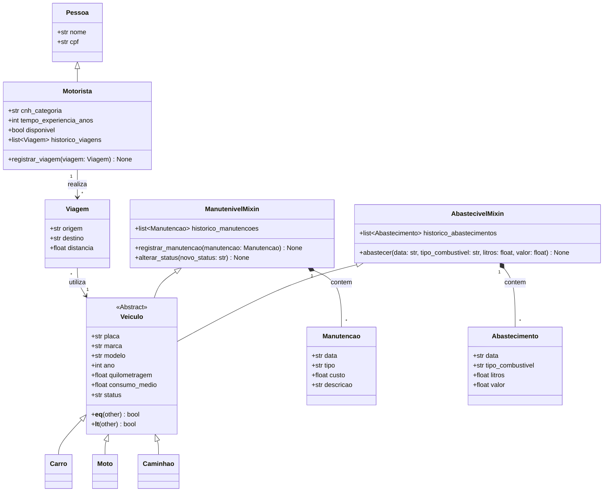

# gerenciamento-de-frota-de-veiculos

## Definição do projeto e Funcionalidades
>Este projeto consiste em um sistema de gerenciamento de frota de veículos desenvolvido em Python como parte da disciplina de Programação Orientada a Objetos.
 
>O projeto objetiva gerenciar a frota de veículos e motoristas de uma empresa de transportes, permitindo o controle de manutenções, o histórico de abastecimentos, a alocação de viagens e a geração de relatórios operacionais e de custos.

## Classes
- **Veiculo**: Classe geral para veículos, é quem herda dos mixins.
- **Carro**, **Moto**, **Caminhao**: Subclasses de **Veiculo**
- **Pessoa**: Classe para registro de dados pessoais.
- **Motorista**: Subclasse de **Pessoa**, contém a categoria da CNH, a experiência profissional e o histórico de viagens.
- **Entidades Auxiliares**:
- `Manutencao`: Registro preventivo de manutenções veiculares, ex: revisão a cada 10,000km.
- `Abastecimento`: Registro de abastecimento veicular e base para cálculo de consumo.
- `Viagem`: Registro da alocação de veículos e dos percursos efetuados.
- **Mixins**:
- `AbastecivelMixin`: Mixin que adiciona histórico e controle de abastecimentos.
- `ManutenivelMixin`: Mixin que adiciona registros de manutenção e controle do status dela.





## Arquitetura do Projeto

>Estrutura de Diretórios

```text
gerenciamento-de-frota-de-veiculos/
│
├── src/
│   ├── __init__.py
│   ├── modelos/
│   │   ├── __init__.py
│   │   ├── pessoa.py
│   │   ├── motorista.py
│   │   ├── mixins.py
│   │   ├── veiculo.py
│   │   └── registros.py
│   └── settings.json
│
├── README.md
└── .gitignore
```

## Aplicação de Conhecimentos Teóricos da Disciplina:
- Linguagem: Python 
- Paradigma: Programação Orientada a Objetos; A modelagem do sistema utiliza conceitos de POO como herança simples, herança múltipla via mixins, encapsulamento e métodos especiais.
- Configuração: Arquivo JSON (`settings.json`) para armazenamento de regras e parâmetros do sistema.

## Como Executar o Sistema 
Atualmente o sistema encontra-se em fase de modelagem inicial.  
Para verificar a estrutura de módulos:
1. Clone o repositório.
2. Certifique-se de ter o Python 3.10+ instalado.
